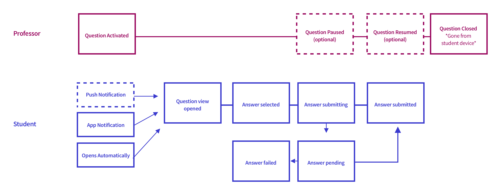

Classroom is Top Hat’s cornerstone product that helped catapult them towards product-market fit, high growth, and venture capital. Top Hat has displaced existing hardware clicker products, in favour of using student’s smartphones and laptops. To date, millions of students have used it in higher education institutions across the United States, Canada, and the UK. From the sound of it, everything in the product must be peachy, right?

When I joined in 2017, Classroom had already been built. The issue was that crucial parts of the user experience had been neglected in a mad scramble for growth. This lead to retention problems because the feature set had become complex, bloated, and basic expectations of usability weren’t being met. The same sad story has befell many products. We weren't unique. We needed to get back to basics and focus on the core experience.

The core experience is relatively simple. A professor asks students a question during their lecture, and students are prompted to answer it on their phone or laptop, while the results display live in class. Professors use this interaction to engage and assess students’ comprehension in real time, so they can pivot their teaching on-the-fly.

> A student's primary task is to answer questions and receive grades for their participation, so they can learn material and do well in their course.

As long as students are able to meet these basic expectations, both users are relatively happy, right? Well, if the hot water’s barely running in your hotel, and you’re not sure how to work the faucet, there’s still a problem. For us, our Classroom apps worked, but it was missing the mark on some basic expectations.

## My Role

_How my project teams were organized_

 

At the time, I worked on Top Hat Classroom leading design on iOS, Android, and two web teams at a ratio of 1 designer : 2 product managers : 14 developers. I lead product design from ideation to implementation.

For this project, I was focused primarily on iOS, since it would have the highest impact on our users. Over 50% of student users submit their answers on iOS devices, so leading the design with iOS in mind made the most sense for this project. Many of the iterative changes we made started on mobile, but were designed and rolled out on the web app to follow.

Our teams’ saving grace and super secret weapon was Jeremy, our user researcher. He worked closely with our product managers Blanca, Asaf, and I so that we were highly aligned around improving the experience based on our research activities not assumptions. Blanca was hyper focused on finding problems, and steered our ship towards solving the right problems.

## The Classroom Experience

Jeremy set us up with professors so that we were able to attend classrooms and perform observational research. We’re lucky that for our use case, it’s relatively easy to observe our product inside of a classroom. What’s more, there was a professor that we partnered with who was using Top Hat only 10 minutes away from our office! There’s no better way to build empathy than to be a part of the experience.

### Checkpoints & Quizzes

One of the most common use cases is for professors to present slides, and ask questions throughout their lecture. They do this to check comprehension and pivot what they need to teach to students in real time. Internally, we called these comprehension checks **checkpoints**.

\

_How a professor checks comprehension throughout a lecture_

Another common use case is for professors to present a 4-5 questions quiz at the beginning of class, to check if students did their homework, and understand their level of comprehension. This activity helps them choose which topics they need to go over again in class.

To enable these types of tasks, students need to be able to answer questions on their device without issues. If there are any problems while asking questions, it disrupts the learning flow, and interrupts a professor’s classroom goals.

### Asking Questions in the Classroom

_The user task flow for asking and answering in the classroom_
 
 

In the “happy path” scenario, professors open a question togather responses from students. Students then open the question, choose a response, and submit their answer. It’s important that their submission is received and grades are recorded.

While this flow might seem simple, what types of issues cause an “unhappy path?” How might we handle cases when there is low network connectivity? What happens when multiple questions are asked at once? How can we encourage students to respond to questions faster, so that we don’t waste valuable class time? How can we make things work the way students expect them to?

## Problems

Someone, somewhere, probably in a Medium article, said “Good designers fall in love with the problem, not their solutions.” My product managers practically oozed user empathy based on all of the research activities we were engaged in. This made it easy for our team to focus discussions around real problems, instead of assumptions. From the observational research, event tracking data, and design heuristics we prioritized which problems we could tackle together.

_This diagram helped align our team around what needs to focus on_

For students in the classroom we discovered the following needs:

1. Open and answer questions faster

   - This keeps the teaching flow moving along inside of the classroom.
   - We noticed some students missed the submit button completely!
   - Some students lagged behind and missed questions

2. General usability issues

   - Students didn’t understand when a question was “closed” or “paused” by a professor. The UI didn’t reinforce what was happening.
   - iOS navigation patterns didn’t feel natural, and caused usability issues. Users would view slides and expect to swipe from slide to slide. There was a lot of unnecessary context switching between views, and confusion while navigating.
   - The UI for questions was inconsistent, did not comply with Accessibility guidelines.
   - The language used to communicate states were different in the professor UI, student web UI, and student mobile UI
   - Style guidelines, and interaction patterns were not well defined or documented.

3. Technical problems that cause reliability and perceived reliability issues

   - Reliability issues caused a lot of noise and confusion in classrooms. Students were flustered and confused when their answers didn’t submit properly.
   - We noticed sometimes students were frustrated and perceived that their answer hadn’t been submitted, when really our UI didn’t clearly communicate what was happening.
   - We save student responses when there is poor network connectivity, but we weren’t doing a great job of letting users know that we had done so.

4. Better assurance of answer submission

   - While submitting, students were unclear if their answer had been submitted. The UI didn’t instill high user confidence.
   - Answer resubmission was unclear. If users changed their answer, they had no idea which answer had been recorded. We noticed students mashing the submit button multiple times to ensure their answer went through.
   - Unsure if they got grades for their answer. We saw that students would immediately check the gradebook after a question was closed, sometimes to their detriment, as they would miss a follow up question as they were busy checking the gradebook.

## Product Dictionary

The first step was to start to align around language. [Adam](http://www.adambourret.com/), another designer on my team, had lead a project on improving the professor experience in Classroom. We came up with a **Product Dictionary** the would help to define what language conventions we’d use in our designs.

_The beginning of our Product Dictionary_

We gathered common terms that we would use to describe actions inside of our product. For example, do you “send” a student’s answer, or do you “submit” a students answer? Aligning our language conventions kept our products in sync, and made the experience less confusing for users.

## Mobile Solutions

I worked on 3-4 different prototypes to help solve some of these issues. To generate ideas, I planned a sketching session with the mobile development team, and a separate session with the design team. I presented some of the problems we identified, we looked at how slides and questions work inside of the app currently. After sketching, I gathered these ideas to put together initial prototypes using Invision to create video clips I could start to send to colleagues on Slack to help start prioritization discussions.

_This is a small taste of some of the UI iterations we explored_

Sometimes you need to dream big and look at the ideal situation, even if it won’t be fully implemented. This can help expand the realm of possibility, and help get better compromises that put greater focus on the user. If you think small, ideas can sometimes get squeezed and scoped down into nonexistence, and in the end the user suffers.

### What We Built

After discussing, prioritizing, and thinking pragmatically about what we could build, we settled upon a design that was still user focused. We prioritized improving the **questions experience**, since it’s the primary task students need to accomplish. The ideas we looked at around optimizing the slides experience were great, but viewing slides is a secondary task, and is used less on mobile due to the screen size.

`vimeo: https://vimeo.com/321020847`

_A walkthrough of the questions UI flow_ <a href="https://overflow.io/s/78N8WQ/" target="_blank" rel="noopener">View the Flow made in Overflow</a>

A piece was still missing. We couldn’t just forget about slides. After all, 50% of the professors that use Classroom present slides in Top Hat. Though, we didn’t have the resources to rebuild how slides worked, so we found a simple compromise to reuse the existing slide carousel functionality. I believe that this compromise actually made the design simpler and clearer to understand for users, and still keeps questions at the forefront.

_Caption: Our implementation using the existing slides carousel_

## User Testing & Roll Out

Another advantage to having access to classrooms, was that we could mitigate product risk by testing new features in classrooms. After building, we loaded a build of the improved classroom experience onto our QA test devices, and brought them to a classroom.

We took videos of students using our app live in a real classroom. This helped us to scoop up some bugs and interaction design issues, allowing us to be more confident to roll it out. From a qualitative standpoint, the design was a success.

To date, we have released it to 100% of users, and it has landed successfully, without any major issues. As the semester progresses, we’re learning more and will have more measurable data.

This is one piece of the retention puzzle. There were other parts of the product that we improved, as well as worked on other people focused strategies to improve retention. Though our current retention rate on Classroom is much higher, it’s hard to attribute it to only one action!
