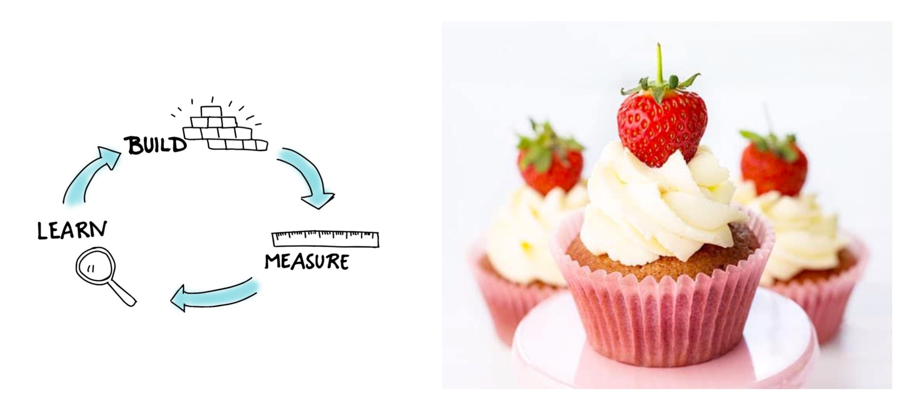
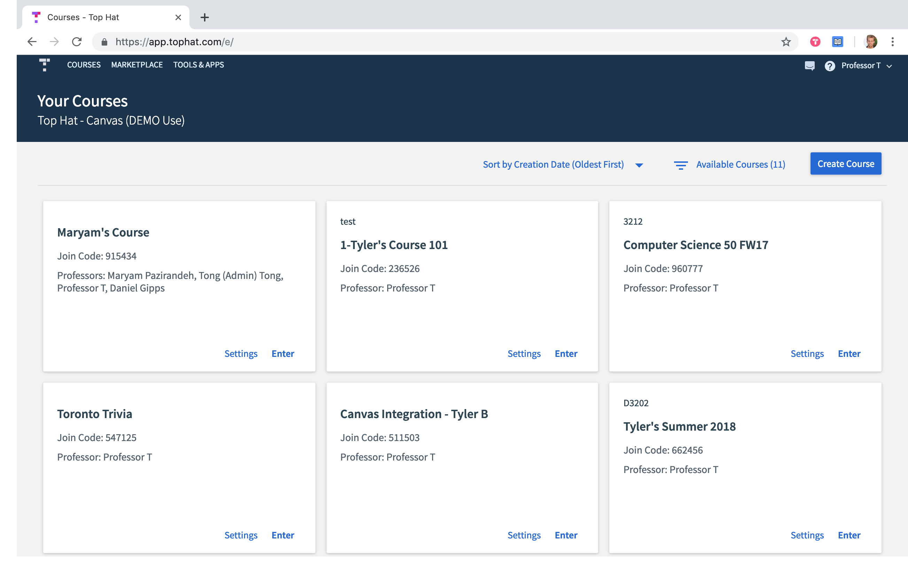
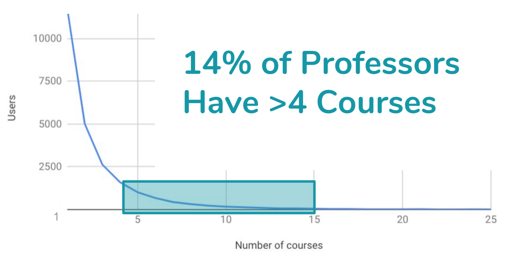
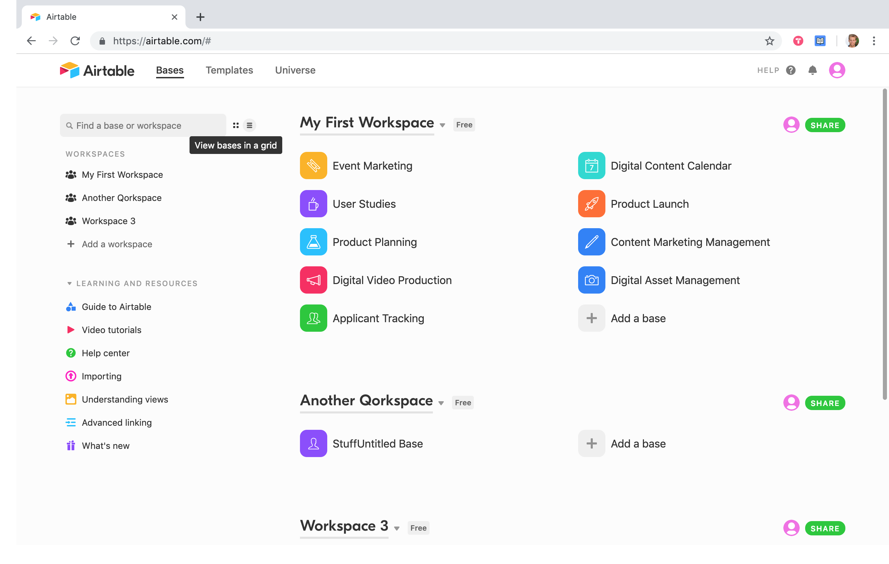
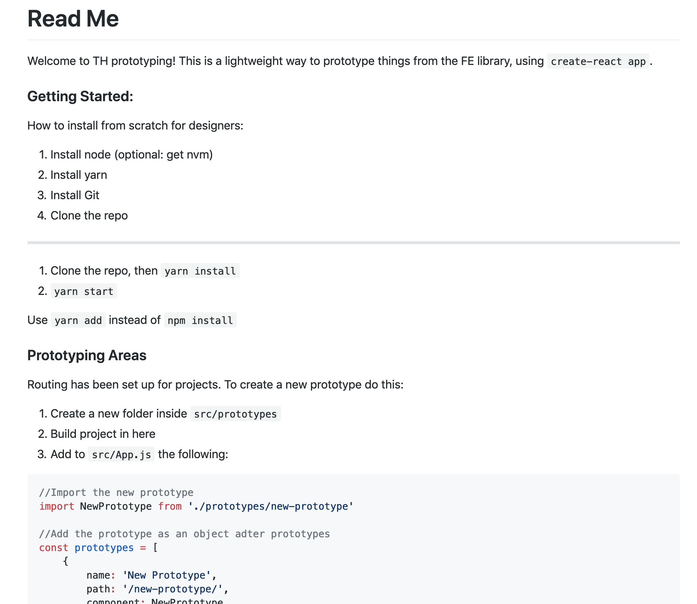
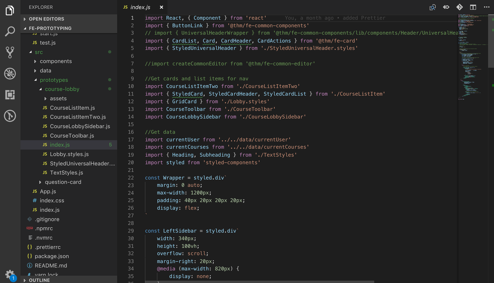

## What is Engineering Week?

Each semester at Top Hat (semester instead of quarter), we have something called Engineering week. Engineering week is the time that everyone stops doing product based sprint work and focuses on a list of projects proposed and pitched by engineers.

There's a dinky metaphor floating around that describes what engineering week is all about – – which I stole from the Engineering leads. So, you’re in a forest chopping trees, but you never have time to sharpen your axe because you’re always too busy chopping trees. Engineering week is the time to stop and sharpen your axe.

This year in the winter semester, I pitched, planned, and led my own engineering week project, notably titled **FE4 Prototyping.** I pitched it as a chance to use our component library to build simple front-end prototypes away from our monolithic architecture.

> A designer or developer can set up a dev environment in under 5 minutes so that they can build a front-end prototype using real FE-Library components

...As a bonus you get to become best friends with me for a week 👬.

A senior developer Jeremy jumped at the chance to be my best friend, and took a chance on the first design-led Engineering week project. I estimated [t-shirt sizes](https://medium.com/radius-engineering/project-estimation-through-t-shirt-size-ea496c631428) for the project and created a week long sprint worth of work.

Jeremy and I settled on a simple project to set up a `create-react-app` that we would hook up to our front-end library to build an improved course lobby. I’d lead the design, and also implemented it with Jeremy’s coaching.

## The Lobby Before

I came up with the idea that the Top Hat course lobby could be improved. It had been built and shipped, and not touched again. I thought it could use a minor facelift, and some general UI improvements.

I did a bit of quantitative research to understand how the lobby was being used. After a quick request to the `#analytics` Slack channel, I found some useful data on how many courses professors had in their course lobby.

_14% of professsors have more than four courses_

It turns out that ~14% of users have >4 courses. I thought it might be nice to improve the UI with a list view so users could skim through their courses easier than in a card view. I also thought it might be helpful to link to other Top Hat resources that often get missed by users, like the support documentation channels. To be honest, I drew some inspiration from Airtable's Workspace area.

## Day 1 & 2

Jeremy spent the first day setting up `create-react-app` and hooking it up to our front-end library. There were hiccups along the way based on how our front end library was hosted. Meanwhile, I worked out final kinks of the design and wrote a ReadMe on how to set up the dev environment.

_The repo's ReadMe_

## Day 3 & 4

I spent time learning about state management in React and how it would help translate my grid and list view designs into code. We worked through how to build out the toggle switch and swap between the list view and grid view.

As a designer, I was immediately attracted to Styled Components, because of how familiar the syntax felt. I'd been a CSS whiz in my past life, and hopping into Styled Components was a breeze.

## Day 5

Wrap up, and tie up loose ends. We finished up the project and did a retrospective on our process.

## The Final Result

`vimeo: https://vimeo.com/321165014`

Overall, it was a positive experience collaborating with engineering at a closer level. It made me closely consider how I put together designs, and how I make compromises with team members. It was a succesful week of learning, empathy building, and practicing javascript.
